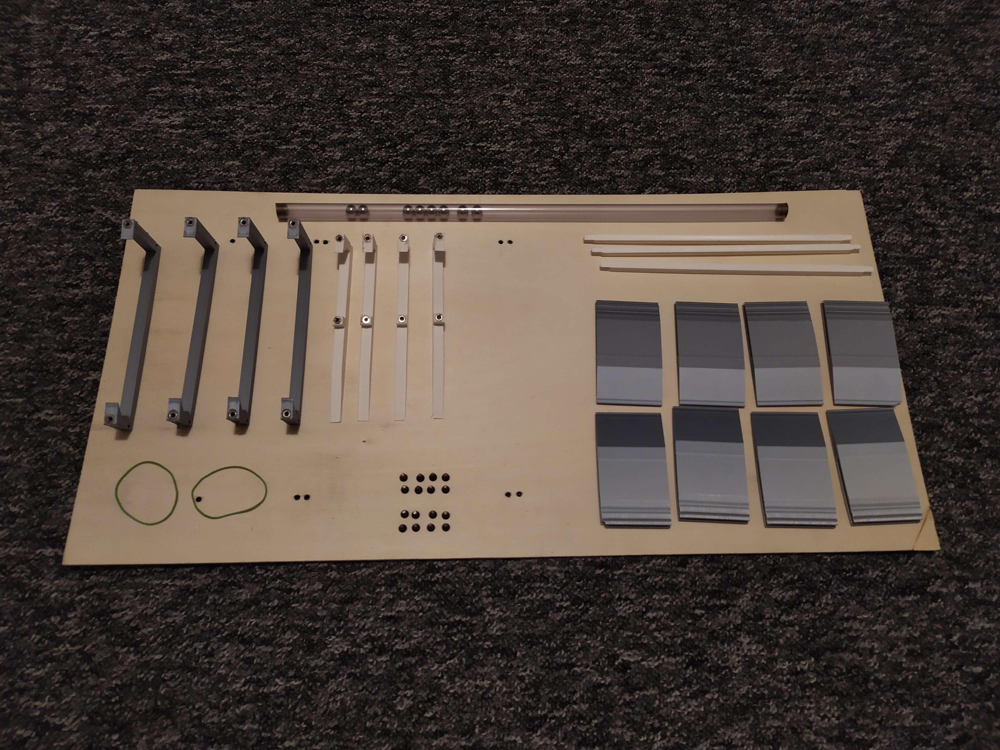

[Angličtina](README.md)

# Houpačka pro Micro:Bit auto
Tato 3D tištěná houpačka je určena k použití jako překážka pro autíčka Micro:Bit. Autíčko musí vyjet na svah a převážit houpačku, aby se převrátila a autíčko mohlo pokračovat dál.

## Materiály, Nástroje a Cena:
### Materiály
- [Překližka (délka: 600 mm; min. šířka: 218 mm; tloušťka: 3 mm nebo 4 mm)](https://www.bauhaus.cz/preklizka-22390413)
- Filament do 3D tiskárny
- 16 šroubů M3 délky mezi 8 mm a 12 mm
- 16 matic M3
- - Závaží (pokud chcete, aby se houpačka vždy vracela na původní stranu (Jak to postavit - verze A))
- 40 cm dlouhá trubka a olověné kuličky o velikosti, která se přesně vejde do trubky (pokud chcete, aby houpačka zůstala na straně, na kterou byla zhoupnuta) (Jak to postavit - verze B)

### Nástroje
- Vrtačka
- Páječka (nebo jiný nástroj pro zahřívání)
### Cena
- ~14 dolarů/350 Kč za kus

## Jak to postavit:

1. Vytisknout [STL soubory](STL_files) (každý soubor má počet potřebných kusů pro daný soubor (např.: 'Support-LLx2.STL' vytisknout 2×))
2. Vytisknout BoltTemplate.svg na papír, výrazně vám pomůže najít správná místa pro přípravu otvorů pro šrouby
3. Umístěte potištěné papíry doprostřed překližky a označte místa, která budete vrtat
4. Po vyvrtání umístěte matice do otvorů v horní části 3D tištěných podpěr a mírně je zahřejte, aby se šrouby zapustily a roztavily a zůstaly na svém místě
5. Sestavte podpěry a spojte je s překližkou pomocí šroubů
6. Vyberte si verzi A nebo verzi B 
A. Přidělejte malé závaží na jednu stranu houpačky 
B1. Vložte olovněné kuličky do trubky a uzavřete otvory čímkoli si myslíte že by bylo vhodné (například korek) 
B2. Mezi dvěma postraními příčnicemi přidělejte trubici pomocí gumiček při krátkodobém používání nebo použijte lepidlo nebo něco podobného při dlouhodobějším použití
7. V případě potřeby můžete rampy použít buď pro [3 mm](STL_files/3mm-ramp.STL) nebo [4 mm](STL_files/4mm-ramp.STL) tlustou překližku

Sestavení konstrukce:

Přidělání trubice s kuličkami:

