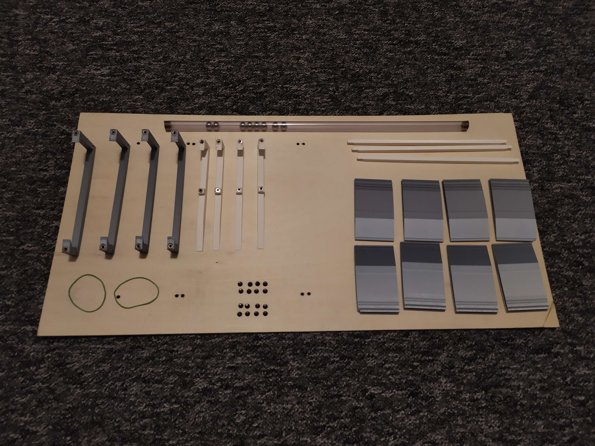

[Czech](README.cs.md)

# Seesaw for Micro:Bit car
This 3D printed seesaw is made for being used as a obstacle for Micro:Bit cars. The car will have to drive up the slope and outweigh the seesaw so it falls over and the car can go on.

## Materials, Tools and Cost:
### Materials
- [Plywood (lenght: 600 mm; min. width: 218 mm; thickness: 3 mm or 4 mm)](https://www.bauhaus.cz/preklizka-22390413)
- [PLA filament](https://www.aliexpress.com/item/4000114755159.html?spm=a2g0o.productlist.main.17.2e0466f00sQgdl&algo_pvid=ac7817f2-3742-4b51-82fc-4d611a10a58c&algo_exp_id=ac7817f2-3742-4b51-82fc-4d611a10a58c-8&pdp_npi=3%40dis%21USD%2162.91%2137.52%21%21%21%21%21%402100bb6416860029785611094d077e%2112000023989298655%21sea%21CZ%210&curPageLogUid=7ShHP0O5lwcL)
- 16 bolts M3 of length between 8 mm and 12 mm
- 16 nuts M3
- Weight (if you want that the seesaw will always return to it's original side (How to Craft version A))
- 40 cm long tube and lead marbles of the size that fit exactly in the tube (if you want that the seesaw will stay on the side it had been swung to) (How to Craft version B)

### Tools
- Drill
- Soldering iron (or other heating tool)
- Hex key or screwdriver (depending on which bolts you use)
- File (if in need to file any edges)
### Cost
- ~14 USD/350 CZK per piece

## How to Craft

1. Print the [STL files](STL_files) (each print the number of times that is written at the end of each file (for example: 'Support-LLx2.STL' print 2×)
2. Print the BoltTemplate.svg on paper, it will greatly help you finding the right spots for preparing holes for your bolts
3. Place the printed papers in the middle of your plywood and mark the spots for you to drill out
4. Once drilled out place the nuts in the holes on top of the 3D printed supports and slightly apply heat to embed and melt in the bolts so they stay fixed in position
5. Assemble the supports and connect them with the plywood using the bolts
6. Choose version A or version B 
A. Install a small weight on one side of the seesaw 
B1. Put the lead marbles in the tube and close the entrances with anything you see fit (for example cork) 
B2. Between the two middle supports on the sides install the tube using rubber bands for temporary use or using glue or something simular for long term use
8. If needed you can use the ramps for either [3 mm](STL_files/3mm-ramp.STL) or [4 mm](STL_files/4mm-ramp.STL) thick plywood

